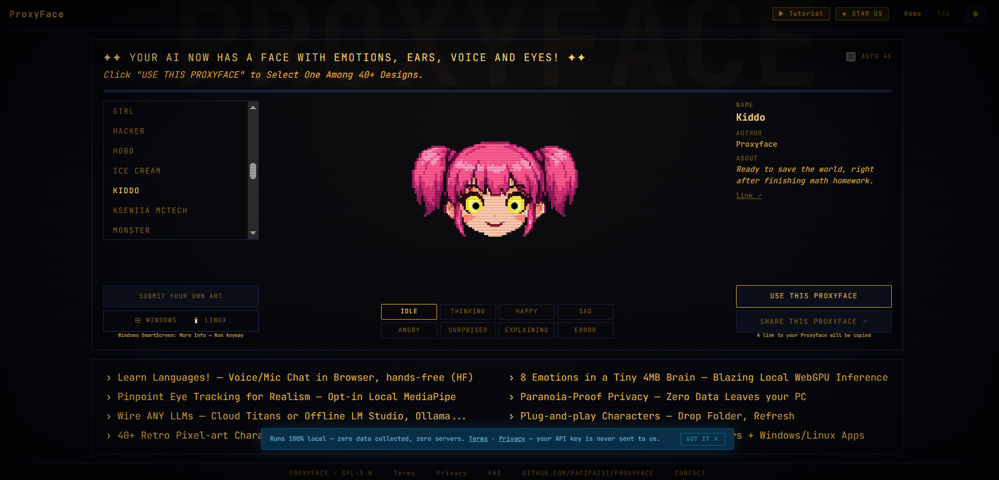
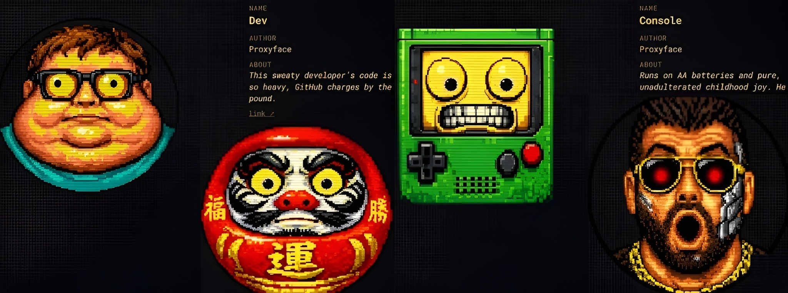
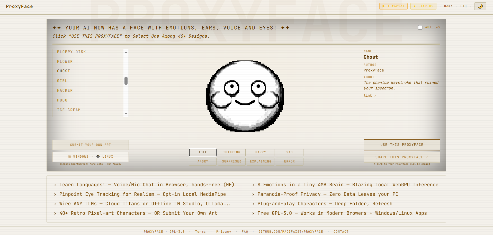
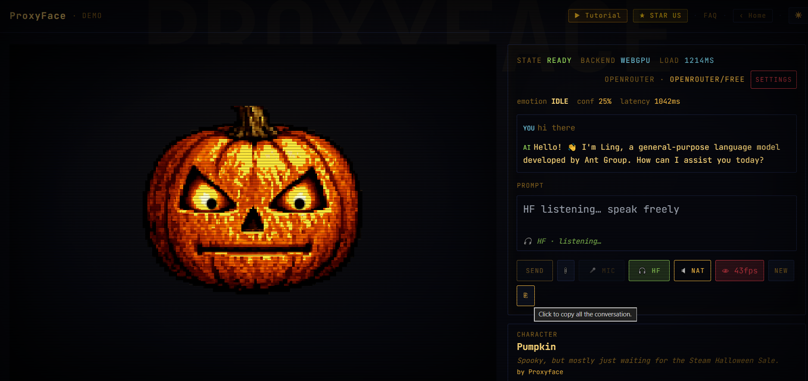

```text
██████╗ ██████╗  ██████╗ ██╗  ██╗██╗   ██╗███████╗ █████╗  ██████╗███████╗
██╔══██╗██╔══██╗██╔═══██╗╚██╗██╔╝╚██╗ ██╔╝██╔════╝██╔══██╗██╔════╝██╔════╝
██████╔╝██████╔╝██║   ██║ ╚███╔╝  ╚████╔╝ █████╗  ███████║██║     █████╗
██╔═══╝ ██╔══██╗██║   ██║ ██╔██╗   ╚██╔╝  ██╔══╝  ██╔══██║██║     ██╔══╝
██║     ██║  ██║╚██████╔╝██╔╝ ██╗   ██║   ██║     ██║  ██║╚██████╗███████╗
╚═╝     ╚═╝  ╚═╝ ╚═════╝ ╚═╝  ╚═╝   ╚═╝   ╚═╝     ╚═╝  ╚═╝ ╚═════╝╚══════╝
```
> **Your AI now has a face, emotions, ears, voice, eyes — and a soul.**  
> 100% local inference. Zero telemetry. Zero cloud. Just vibes.



[ProxyFace.com](https://proxyface.com/) renders a pixel-art avatar that reacts in **real time** to LLM output via a 4 MB TinyBERT emotion model running entirely on your GPU (WebGPU) or CPU (WASM). It listens, speaks, watches your eyes, and never sends a single byte of your conversation anywhere.

Quick 30-second setup:
<p align="left">
  <a href="https://www.youtube.com/watch?v=A8DV9MGaRuw">
    
  </a>
</p>

--- 

## ✨ What makes it special

### 🎧 Hands-Free (HF) — learn languages while you talk
This HF mode allows you to have a conversation with the AI taking long pauses (configurable in the settings) as the automatic message to send.
You can also hold **Alt+T** to speak. Release to send. The AI replies in your target language with its face reacting to every word — embarrassed, curious, delighted. No typing. No clicking. Just conversation.

> *"I use it to practice Japanese. The pumpkin face going SURPRISED every time I say something wrong is weirdly motivating."*

### 🧠 4 MB emotion brain — runs at 60 ms on your GPU
TinyBERT INT8 ONNX, trained on 3 200 sentences across 8 emotions. Runs via WebGPU in Chrome — no Python, no server, no API key for inference. The face reacts to the AI's output, not yours.

### 🎨 40+ pixel-art characters — or submit your own for a Community-based art


Drop a sprite sheet in `sprites/art/yourname/` and run one sync script. Your character appears instantly. Submit it to us for priority for a place in the official gallery.

Currently, the following YouTube personalities have their own art!
| Personality | Description | Proxyface |
|-------------|-------------|-----------|
| [Naoto Matsumoto](https://www.youtube.com/@NaotoMatsumoto) | A YouTuber who teaches Taoism and Zen | [Demo](https://proxyface.com/?proxyface=surfer#/demo) |
| [Kseniia McTech](https://www.youtube.com/@KseniiaMcTech) | A YouTuber that highlights deep tech news | [Demo](https://proxyface.com/?proxyface=kseniia#/demo) |
| [Donal (a.k.a. The Croupier)](https://compuwood.com/) | A Spanish YouTuber who is all a character | [Demo](https://proxyface.com/?proxyface=croupier#/demo) |

### 👁️ Eye tracking — opt-in, on-device to enhance interactivity
MediaPipe face landmarker runs locally. The pupils follow your gaze. No video ever leaves your machine.

### 🔊 Voice I/O — bot mode, natural mode, or silent
- **HF mode**: fully-auto bilateral conversation
- **Semi-auto**: hold Alt+T → speak → auto-send → AI replies
- **Bot mode**: typewriter sound while the AI streams
- **Natural mode**: browser TTS reads the reply aloud using API TTS (paid, high quality) or the built in (free, medium quality)

### 🔒 Privacy-proof ([PRIVACY notice](https://github.com/PacifAIst/Proxyface/blob/main/PRIVACY.md))
Zero network calls for inference. Your API key lives in `localStorage`, never transmitted to us. [GPL-3.0 — read every line](https://github.com/PacifAIst/Proxyface/blob/main/LICENSE).

---

## Screenshots

| Dark mode | Light mode |
|-----------|------------|
|  |  |



---

## 🚀 Quickstart

### Web (browser, any OS)
```bash
git clone https://github.com/PacifAIst/Proxyface.git
cd Proxyface
pnpm install
cd apps/web && pnpm dev
# open http://localhost:5173
```

### Windows desktop app
Download **[ProxyFace Setup 0.1.0.exe](https://github.com/PacifAIst/Proxyface/releases/latest)** from Releases.  
> Windows SmartScreen may appear — click **More info → Run anyway**. This is expected for unsigned indie apps.

### Mock mode (no API key needed)
Visit `http://localhost:5173/?mock=1` — uses a regex classifier instead of the neural model. Good for UI testing.

---

## 🎮 Secret easter eggs

There are hidden features. 

---

## 🎨 Submit your art

Want your character in the official gallery?

**Specs:** 4096×2048 PNG · 16 columns × 8 rows · 256×256 px per cell · 8 emotion rows · transparent background · 1993 pixel-art style

**Best AI tool for generation:** [Kimi 2.6 in agent mode](https://kimi.com) (free tier) — attach an existing atlas as reference.

- **Email:** `yes@proxyface.com` — subject: `[CHARACTER NAME]`
- **GitHub PR:** fork → add `sprites/art/yourname/` → open PR with screenshot of all 8 emotion rows

---

## ⚙️ Tech stack

| Concern | Choice |
|---|---|
| Monorepo | pnpm workspaces + Turborepo |
| Framework | React 18 + TypeScript 5 |
| Bundler | Vite 5 |
| Styling | Tailwind CSS 3 (shared CRT preset) |
| Emotion model | TinyBERT INT8 ONNX via `@huggingface/transformers` |
| ML runtime | ONNX Runtime Web (WebGPU + WASM fallback) |
| Vision | `@mediapipe/tasks-vision` (on-device) |
| Voice | Web Speech API + browser TTS |
| Desktop | Electron 30 |

---

## 🔧 Development

```bash
pnpm install          # install everything
cd apps/web
pnpm dev              # http://localhost:5173

# Sync sprites + models into public/ before building
pnpm sync-assets

# Production build
pnpm build
```

### Retrain the emotion model
Open `proxyface_train.ipynb` in Google Colab (T4 GPU).  
Upload `proxyface_emotions.jsonl` → Run All → download zip → drop into `packages/proxyface-core/src/assets/models/emotion/`.

---

## 📁 Repository layout

```
proxyface/
├── apps/
│   ├── desktop/             # Electron wrapper
│   └── web/                 # Standalone web app (also embedded in desktop)
└── packages/
    └── proxyface-core/      # Shared React components, hooks, ML worker, design tokens
        └── src/
            ├── assets/models/emotion/   # TinyBERT INT8 ONNX + tokenizer
            └── assets/sprites/art/      # Character sprite sheets
```

---

## 📄 License

**GPL-3.0** — free to use, fork, and modify. Derivative works must remain open source.  

---

## ⭐ Star us

If ProxyFace made your AI feel alive, [give us a star](https://github.com/PacifAIst/Proxyface) — it helps more than you think.

Contact: [yes@proxyface.com](mailto:yes@proxyface.com)
